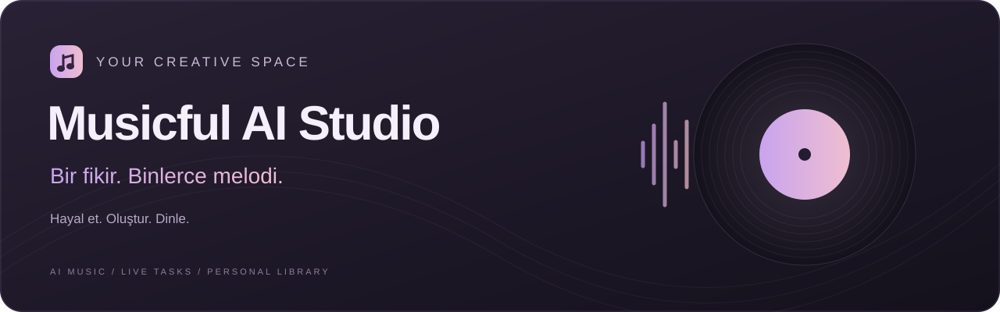

<div align="center">



**Aklındaki sesi şarkıya dönüştüren kişisel stüdyon.**

Bir kayıt yükle ya da birkaç kelimeyle başla. Üretimini takip et, kütüphaneni keşfet ve dinle.


[Özellikler](#stüdyoda-neler-var) · [Hızlı başlangıç](#hızlı-başlangıç) · [Bağlantılar](#bağlantı-ayarları) · [Geliştirme](#geliştirme)

</div>

---

## Stüdyoda neler var?

| | Araç | Neler yapabilirsin? |
| :---: | --- | --- |
| 🎵 | **Müzik üretimi** | Açıklamadan şarkı oluştur; yüklediğin sesle cover üretimini başlat. |
| ✨ | **Yaratıcı araçlar** | Ses efekti veya döngü üret, sözleri harmanla, bir bölümü değiştir ya da videoya müzik oluştur. |
| 🎧 | **Dinleme alanı** | YouTube seslerini yt-dlp üzerinden önizle; kütüphanendeki şarkıları oynat. |
| 📡 | **Canlı görev takibi** | Üretim tamamlandığında SSE ile güncellenen sonuçları takip et. |
| 🗂️ | **Kişisel kütüphane** | Şarkılarını ara, indir, WAV çıktısı hazırla ve taslaklarına geri dön. |
| 🔑 | **Hesap yönetimi** | Hesaplarını yönet, arka planda oturum yenile ve kredi hareketlerini incele. |

### Birbiriyle uyumlu bir deneyim

Koyu erik tonları, lavanta ve pembe vurgular; üretim ekranından ayarlara kadar aynı görsel dil. Taslaklar, işlem kuyruğu, hızlı arama ve hesap kayıtları stüdyonun bir parçası olarak tasarlandı.

## Hızlı başlangıç

### 01 — Hazırlan

Windows üzerinde **Python 3.12**, **Node.js** ve depoyu klonlamak için **Git** kurulu olmalı. Python ve Node.js komutlarının terminalden erişilebilir olduğundan emin ol.

```shell
git clone https://github.com/seghobs/mus_ic_fulv2.git
cd mus_ic_fulv2
```

### 02 — Stüdyoyu aç

**`calistir.bat`** dosyasına çift tıkla.

Başlatıcı bağımlılıkları kontrol eder, sunucuyu hazırlar ve uygulama yanıt vermeye başladığında tarayıcıyı açar.

| Adres | Kapatma |
| --- | --- |
| [127.0.0.1:5000](http://127.0.0.1:5000) | Terminalde **Ctrl + C** |

### 03 — İlk fikrini dene

**Ayarlar** bölümünden hesabını kontrol et. Bir ses kaydı yükle veya **Yazıdan Şarkı Üret** seçeneğine geç; sözlerini ve tarzını belirleyip üretimi başlat.

> Üretim, WAV ve diğer servis işlemleri hesabının planına göre kredi kullanabilir.

## Bağlantı ayarları

<details>
<summary><strong>✨ Gemini — söz, stil ve görsel araçları</strong></summary>

<br>

`GEMINI_API_KEY` ortam değişkenini ayarla veya proje kökünde `gemini.local.json` dosyası oluştur:

```json
{
  "api_key": "YOUR_GEMINI_API_KEY"
}
```

Ortam değişkeni tanımlıysa öncelikli olarak kullanılır. Yerel anahtar dosyası Git tarafından yok sayılır. Model tercihleri `models.json` içinde bulunur.

</details>

<details>
<summary><strong>▶ YouTube — kanal bağlantısı</strong></summary>

<br>

Kanal arşivi ve yükleme işlemleri için yerel YouTube OAuth yapılandırması gerekir. Bu bağlantı dosyaları depoya dahil değildir. Ses önizlemesi ise yt-dlp üzerinden çalışır.

</details>

<details>
<summary><strong>🗃️ Hesaplar ve kayıtların saklanması</strong></summary>

<br>

Bu deponun mevcut sürümünde **hesaplar, Musicful tokenleri ve uygulama kayıtları Git takibindedir**. Depoya erişimi olan kişiler bu bilgileri görebilir.

| Konum | İçerik |
| --- | --- |
| `accounts.json` | Hesap kayıtları |
| `tokens.json` | Musicful oturum tokenleri |
| `data/` | Taslaklar, ayarlar, görevler ve kütüphane kayıtları |
| `gemini.local.json` | Yerel Gemini anahtarı; Git dışında |
| `static/covers/`, `static/videos/` | Oluşturulan medya; Git dışında |

</details>

## Geliştirme

```text
mus_ic_fulv2/
├── app.py              Flask uygulaması
├── calistir.py         Hazırlık ve başlatma akışı
├── core/               Oturum, akış ve görev altyapısı
├── routes/             Uygulama uç noktaları
├── services/           Gemini araçları
├── static/             Stiller ve tarayıcı kodu
├── templates/          Sayfalar ve pencereler
├── tests/              Python ve JavaScript testleri
└── data/               Uygulama kayıtları
```

### Testleri çalıştır

```shell
python -m unittest discover -s tests
node --test tests/*.test.cjs
```

Testler; oturum yenileme, hesap ayrımı, üretim sonuçları, SSE bildirimleri, oynatma ve başlatıcı davranışlarını kapsar.

---

<div align="center">

**Hayal et. Oluştur. Dinle.**

<sub>Musicful AI Studio · Yaratıcılığın için küçük bir stüdyo.</sub>

</div>
